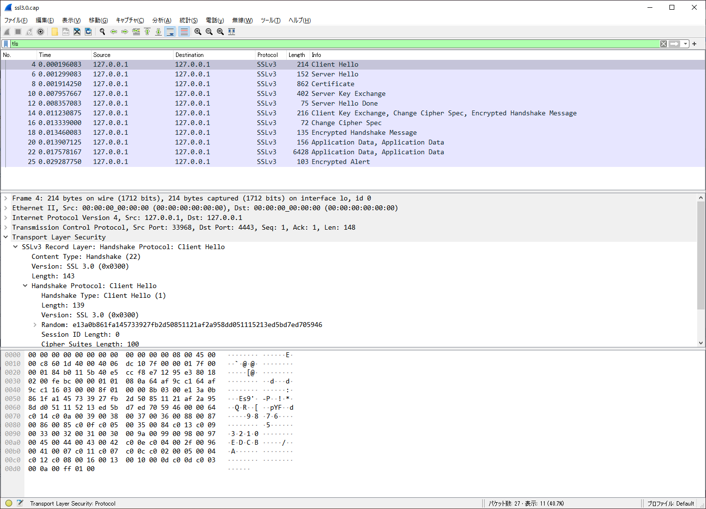
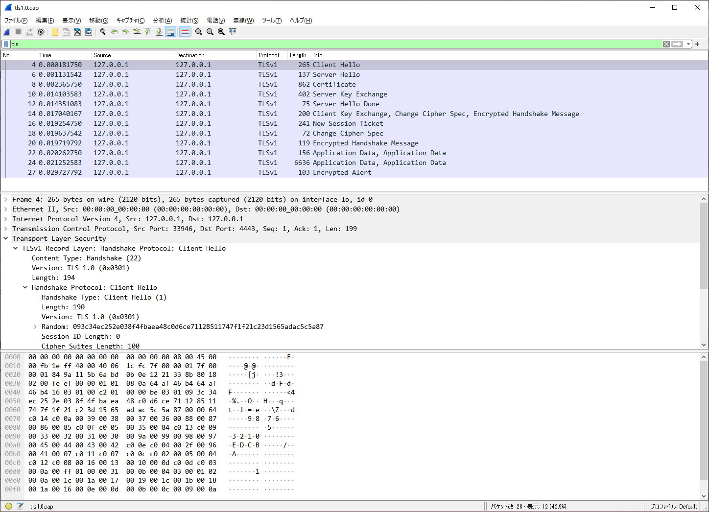
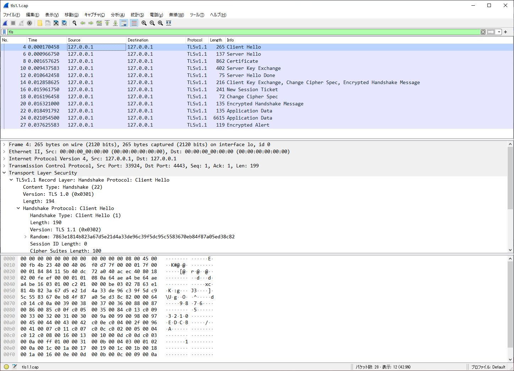
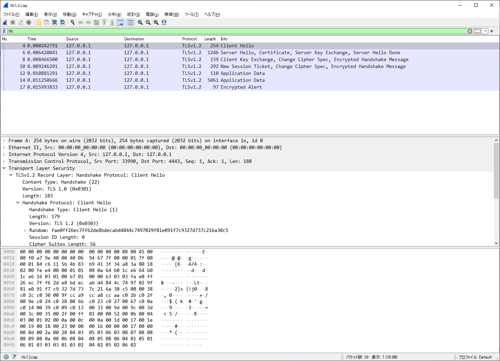
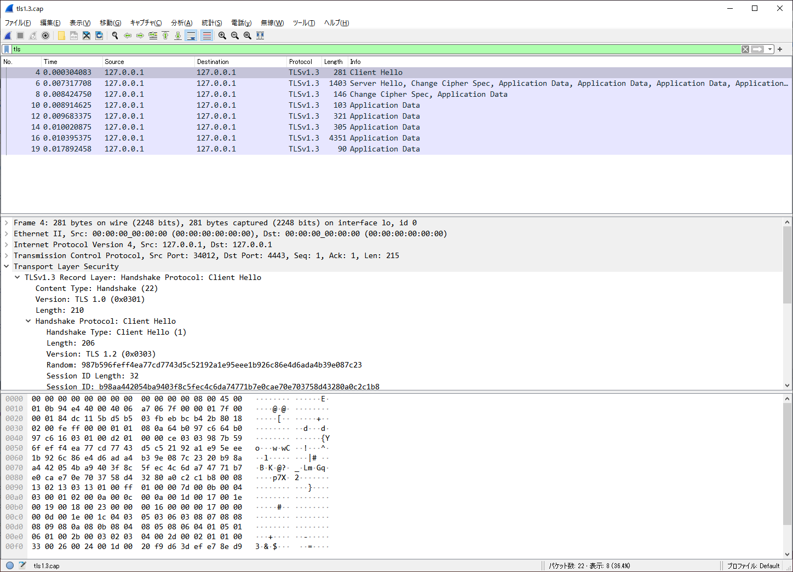

# OpenSSL PlayGround

**SSL 3.0 :**



**TLS 1.0 :**



**TLS 1.1 :**



**TLS 1.2 :**



**TLS 1.3 :**




Source Code:

https://www.openssl.org/source/old/


Docker:
```bash
# Build container
docker build -t tex2e/openssl-playground .
# Run with packet capturable options.
docker run -it --rm --cap-add=NET_RAW --cap-add=NET_ADMIN tex2e/openssl-playground bash

# When open new terminal
docker exec -it $(docker ps --latest -q) bash
```

Version Check:
```bash
/opt/openssl-1.1.1j/bin/openssl version
/opt/openssl-1.0.2k/bin/openssl version
```

### Server Side
```bash
cd /tmp/www
# TLS 1.3, TLS 1.2
/opt/openssl-1.1.1j/bin/openssl s_server -debug -msg -accept 4443 -cert /etc/ssl/certs/server.crt -key /etc/ssl/private/server.key -www
# TLS 1.1, TLS 1.0, SSL 3.0
/opt/openssl-1.0.2k/bin/openssl s_server -debug -msg -accept 4443 -cert /etc/ssl/certs/server.crt -key /etc/ssl/private/server.key -www
```

### Client Side
```bash
# TLS 1.3
(echo "GET / HTTP/1.1"; sleep 1) | /opt/openssl-1.1.1j/bin/openssl s_client -tls1_3 -connect localhost:4443
# TLS 1.2
(echo "GET / HTTP/1.1"; sleep 1) | /opt/openssl-1.1.1j/bin/openssl s_client -tls1_2 -connect localhost:4443
# TLS 1.1
(echo "GET / HTTP/1.1"; sleep 1) | /opt/openssl-1.0.2k/bin/openssl s_client -tls1_1 -connect localhost:4443
# TLS 1.0
(echo "GET / HTTP/1.1"; sleep 1) | /opt/openssl-1.0.2k/bin/openssl s_client -tls1 -connect localhost:4443
# SSL 3.0
(echo "GET / HTTP/1.1"; sleep 1) | /opt/openssl-1.0.2k/bin/openssl s_client -ssl3 -connect localhost:4443
```

Packet Capture:
```bash
cd /tmp/pcap
tshark -i lo -w tls1.3.cap -l host localhost and port 4443
tshark -i lo -w tls1.2.cap -l host localhost and port 4443
tshark -i lo -w tls1.1.cap -l host localhost and port 4443
tshark -i lo -w tls1.0.cap -l host localhost and port 4443
tshark -i lo -w ssl3.0.cap -l host localhost and port 4443
```

Copy pcapng files from container:
```bash
docker cp $(docker ps --latest -q):/tmp/pcap/tls1.3.cap .
docker cp $(docker ps --latest -q):/tmp/pcap/tls1.2.cap .
docker cp $(docker ps --latest -q):/tmp/pcap/tls1.1.cap .
docker cp $(docker ps --latest -q):/tmp/pcap/tls1.0.cap .
docker cp $(docker ps --latest -q):/tmp/pcap/ssl3.0.cap .
```


